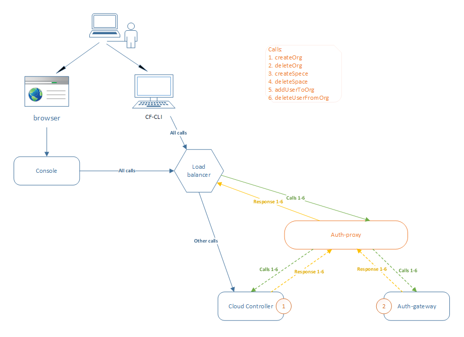

[](https://www.versioneye.com/user/projects/5723601bba37ce0031fc19a8)

# Auth-proxy
>Service that provides centralized entry point for handling requests regarding granting and revoking permissions
>to cloud foundry and Hadoop.

## General description
Auth-proxy ensures that some of the request to Cloud Controller are intercepted and delegated
to both Cloud Controller and Auth-gateway. It performs necessary translation of Cloud Foundry
API calls to Auth-gateway API. This ensures that Auth-gateway is notified about all requests that
grant or revoke access to some of the platform components (e.g. organization). Having this
information Auth-gateway can perform additional actions regarding access and security in Hadoop.

## The request flow


User actions performed either through Console or CF CLI result in REST calls to Cloud Controller. All
of them are routed via Load balancer which is configured to intercept some of them (defined in next
section) and to delegate them to Auth-proxy.
Auth-proxy optionally translates resource names (e.g organization, user) into guid's and then
sequentially calls Cloud Controller and Auth-gateway. All actions delegated through Auth-proxy
are idempotent.
Service logically is communicating with Cloud Controller and Auth-gateway but on network level
whole communication goes through load balancer (that's why there are dashed arrows between Auth-proxy
and Cloud Controller or Auth-gateway).

## Auth-proxy REST Api (consistent with CF api docs)
-   Create organization 
    (https://apidocs.cloudfoundry.org/225/organizations/creating_an_organization.html)
    ```
    POST /v2/organizations
    ```

-   Delete organization 
    (https://apidocs.cloudfoundry.org/225/organizations/delete_a_particular_organization.html)
    ```
    DELETE /v2/organizations/:org_guid
    ```

-   Add user to organization (by guid)
    (https://apidocs.cloudfoundry.org/225/organizations/associate_user_with_the_organization.html)
    ```
    PUT /v2/organizations/:org_guid/users/:user_guid
    ```
  
    (https://apidocs.cloudfoundry.org/225/users/associate_organization_with_the_user.html)
    ```
    PUT /v2/users/:user_guid/organizations/:org_guid
    ```

-   Remove user from organization (by guid)
    (https://apidocs.cloudfoundry.org/225/organizations/remove_user_from_the_organization.html)
    ```
    DELETE /v2/organizations/:org_guid/users/:user_guid
    ```
   
    (https://apidocs.cloudfoundry.org/225/users/remove_organization_from_the_user.html)
    ```
    DELETE /v2/users/:user_guid/organizations/:org_guid
    ```
        
Whole sequence diagram of how auth-proxy responses in certain situations can be found here: 

## Configuration

Although, running in cloud, auth-proxy is able to fetch all configuration properties automatically, it is possible to overwrite the default configuration.
To do that, set proper environment variable as follows::

| Property name | Description |
| --- | --- |
| DOMAIN | Domain of the environment |
| CF_API_HOST | Hostname of the original CF API |
| AUTH_GATEWAY_HOAT | Hostname of auth-gateway app |
| TOKEN_KEY_URL | URL to the UAA's key public |
 
To set environment variable for CF app:
```sh
cf set-env auth-proxy <env name> <value>
```

## Local development
Auth-proxy is a nodejs application. First install all dependencies:
```sh
npm install
```

Allthough, in cloud environment auth-proxy is able to automatically determine domain under it is currently running, it is necessary to set that manually during local development.
```sh
export DOMAIN <base domain name>
```

When configuration is ready, start server:
```sh
npm start
```

## Deploy as application in TAP
Install nodejs dependencies:
```sh
npm install
```
Then you can push application:
```sh
cf push
```
